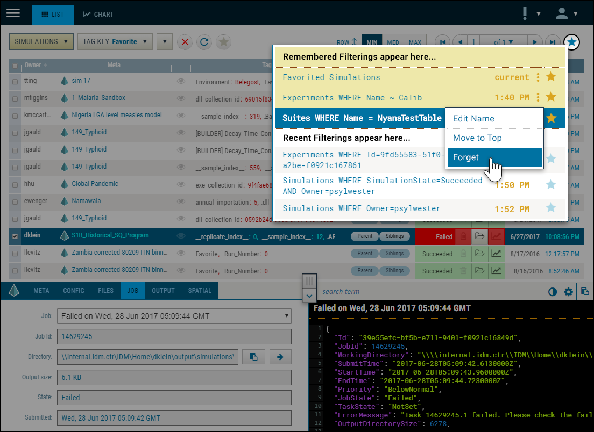

###### This is pre-released software. Please **[log issues](/issues)** found.
# Filtering
A client view for capturing and managing filter history.

This is the same code implemented in the COMPS Web Client. Included within this repository is the required JavaScript, interface template (HTML), and styling (CSS). A simple demonstration is provided (see [the demo](/demo)). An illustration of this design: 

### Gist 

***

### Basic Usage

***

### Installation

***

### Configuration Options

***

### Public Methods (API)
